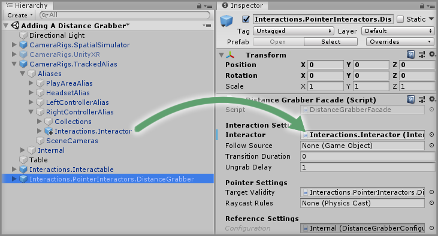
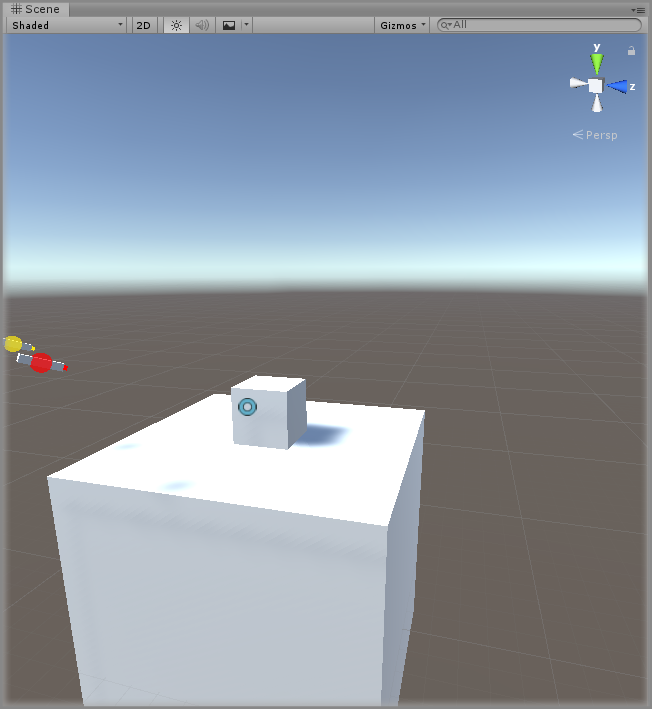
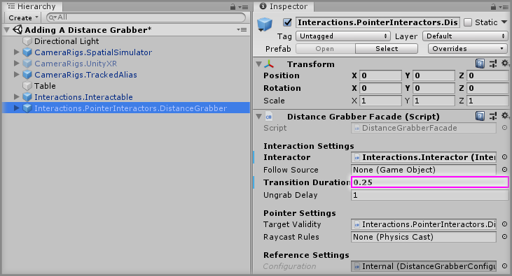
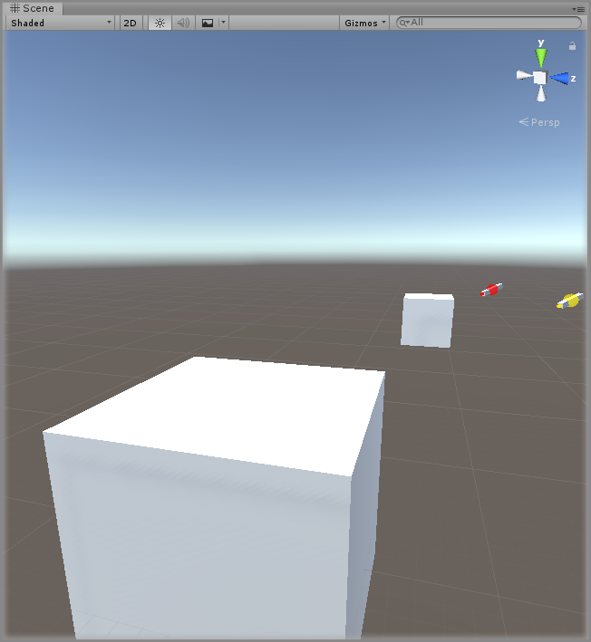

# Adding A Distance Grabber

> * Level: Beginner
>
> * Reading Time: 5 minutes
>
> * Checked with: Unity 2018.3.14f1

## Introduction

A common problem in spatial scenes is trying to grab an object that is just out of reach or too far away for you to physically be able to get to. This could be solved using locomotive techniques and allowing the user to move nearer to objects in the virtual environment, or we could use our special powers and forcibly grab distant items straight to our hand Interactor.

The `Interactions.PointerInteractors.DistanceGrabber` prefab allows for an easy way to set this technique up and it simply uses an Object Pointer with an invisible beam to identify Interactable Objects in the scene and pressing our Interactor grab button will tell the Object Pointer to initiate a grab on that object.

## Prerequisites

* [Add the Tilia.Interactions.Interactables.Unity -> Interactions.Interactable] prefab to the scene hierarchy.
* [Install the Tilia.Interactions.PointerInteractors.Unity] package dependency in to your [Unity] project.

## Let's Start

### Step 1

Add a `Interactions.PointerInteractors.DistanceGrabber` prefab to the Unity project hierarchy by selecting `GameObject -> Tilia -> Prefabs -> Interactions -> Interactors -> Interactions.PointerInteractors.DistanceGrabber` from the Unity main top menu.

### Step 2

Now all we need to do is tell our Distance Grabber which Interactor we want to associate it with. We'll just associate this new Distance Grabber with our right hand Interactor.

> If you want both hands to be able to distant grab then you just need to add in two `Interactions.PointerInteractors.DistanceGrabber` prefabs and associate them with each hand Interactor.

Drag and drop the `CameraRigs.TrackedAlias -> Aliases -> RightControllerAlias -> Interactions.Interactor` GameObject into the `Interactor` property on the `Distance Grabber Facade` component within the `Interactions.PointerInteractors.DistanceGrabber` GameObject.

### Step 3

Play the Unity scene and point your hand at the Interactable cube, you should see a pulsing cursor appear over the Interactable cube notifying you that you can distant grab this object. Pressing your grab button on the Interactor will instantly snap the Interactable cube to your Interactor hand.

### Step 4

We can now instantly snap the Interactable cube directly to our Interactor, but what if we wanted a nice timely transition of the Interactable cube flying through the air to our Interactor as if we were willing it there with our mind?

Well, this is simple to achieve by just increasing the `Transition Duration` property on the `Distance Grabber Facade` component. The a higher duration means the selected Interactable will take that long to reach the grabbing Interactor.

Select the `Interactions.PointerInteractors.DistanceGrabber` GameObject from the Unity Hierarchy window and on the `Distance Grabber Facade` component change the `Transition Duration` property value to `0.25`. This means that the selected Interactable will take `0.25` seconds to reach our Interactor from the moment of grabbing it.

### Done

Play the Unity scene and again point your hand at the Interactable cube and press the grab button. You'll now notice that the cube glides towards your Interactor hand and takes about a quarter of a second to reach your hand.

[Add the Tilia.Interactions.Interactables.Unity -> Interactions.Interactable]: https://github.com/ExtendRealityLtd/Tilia.Interactions.Interactables.Unity/blob/master/Documentation/HowToGuides/AddingAnInteractable/README.md
[Install the Tilia.Interactions.PointerInteractors.Unity]: ../Installation/README.md
[Unity]: https://unity3d.com/